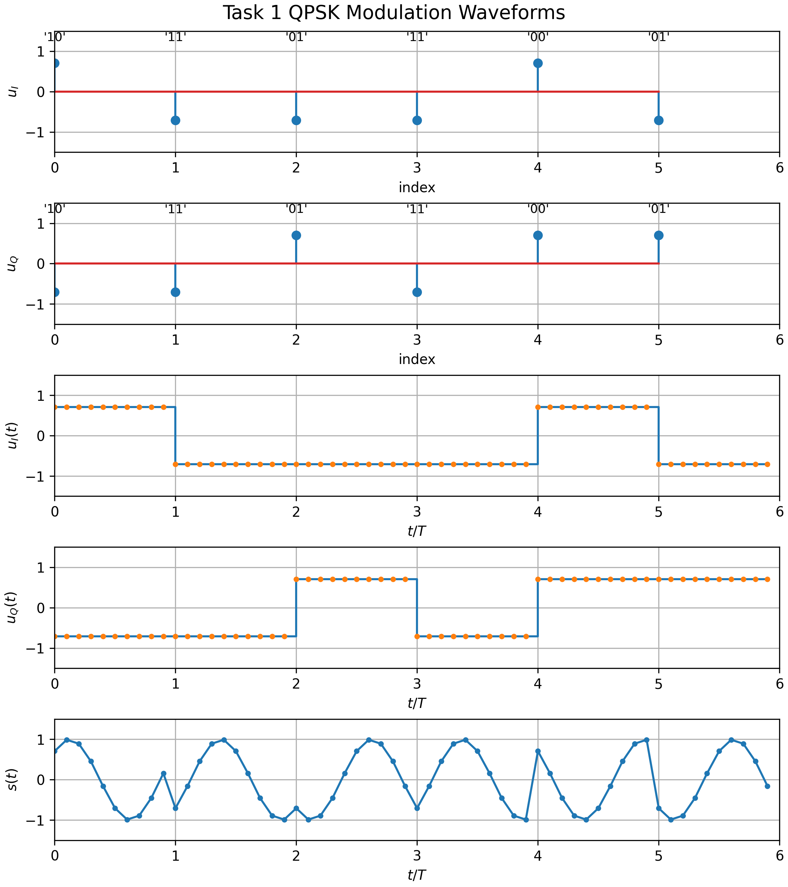
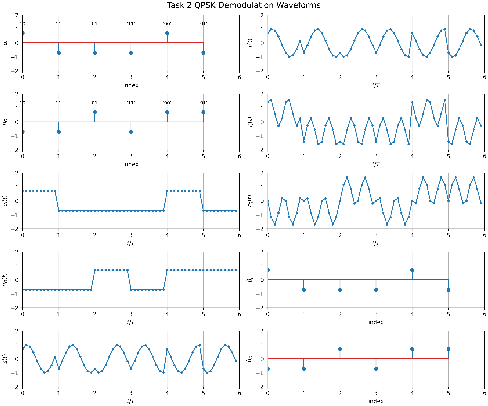
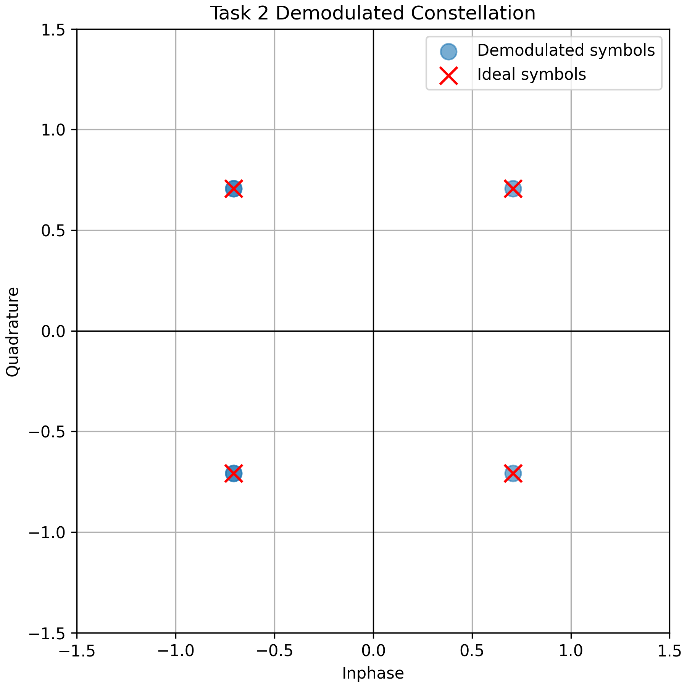
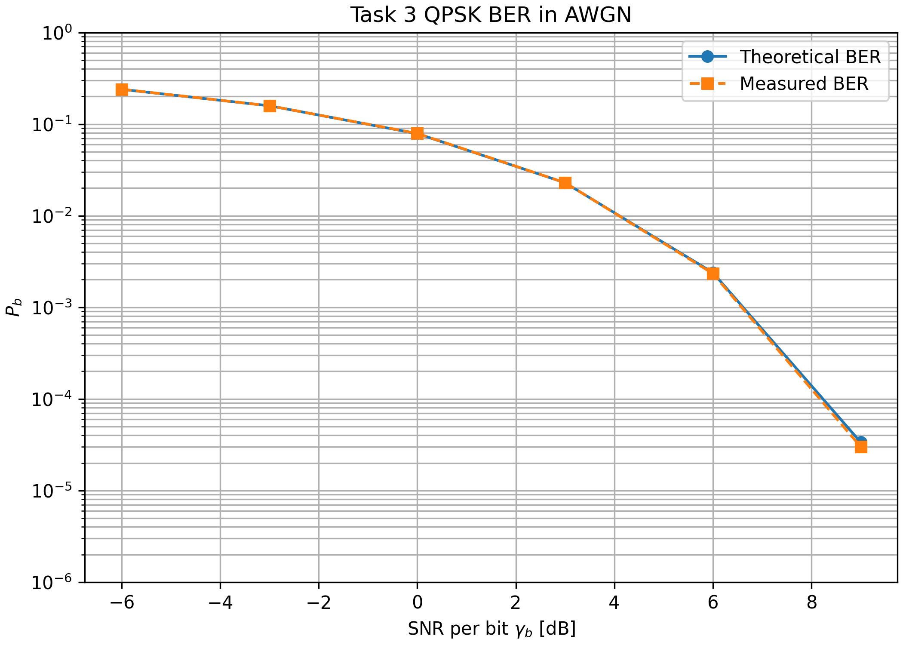
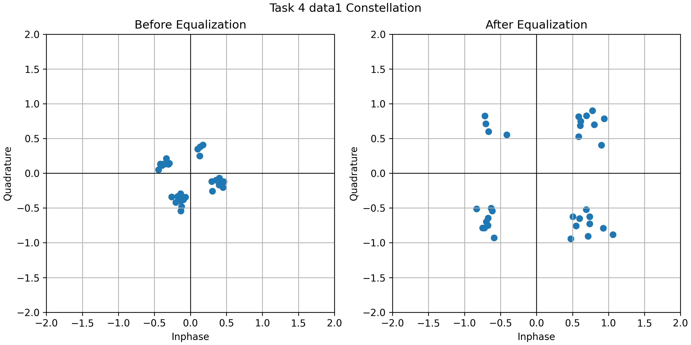
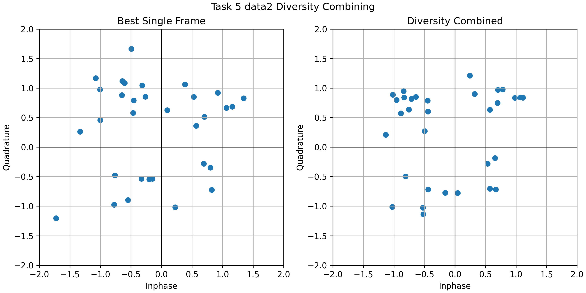

# 実験IV-3 デジタル変復調回路 レポート本文案

## 1。シミュレーション条件

実験で用いた共通パラメータを表1に示す。

| パラメータ | 値 |
| --- | ---: |
| 搬送波周波数 `fc` | 100 Hz |
| シンボルレート `R` | 100 symbols/s |
| シンボル周期 `T` | 0.01 s |
| サンプリング周波数 `Fs` | 1000 Hz |
| サンプル周期 `Ts` | 0.001 s |
| 1シンボルあたりのサンプル数 | 10 |

プログラムはNotebookには依存させず、共通処理を `src/`、各実施内容の実行スクリプトを `tasks/` に分けて実装した。乱数を用いる実施内容3では、再現性のためseedを固定した。

## 2。実施内容1 QPSK変調回路

### 2。1 方法

情報ビット列として

```text
101101110001
```

を用いた。これを2ビットずつ区切ると、

```text
10, 11, 01, 11, 00, 01
```

の6シンボルとなる。各ビット対をQPSKの位相へ写像し、同相成分 `u_I` と直交成分 `u_Q` を求めた。その後、各シンボル値を10サンプルずつ繰り返す矩形パルス整形を行い、搬送波を掛け合わせて帯域信号 `s(t)` を生成した。

本実験で用いたビット対と位相の対応は次の通りである。

| ビット対 | 位相 |
| --- | ---: |
| 00 | pi/4 |
| 01 | 3pi/4 |
| 11 | 5pi/4 |
| 10 | 7pi/4 |

### 2。2 結果

図11にQPSK変調によって得られた送信側波形を示す。



各シンボルの値を表2に示す。

| ビット対 | `u_I` | `u_Q` | 位相 rad |
| --- | ---: | ---: | ---: |
| 10 | 0.7071 | -0.7071 | 5.4978 |
| 11 | -0.7071 | -0.7071 | 3.9270 |
| 01 | -0.7071 | 0.7071 | 2.3562 |
| 11 | -0.7071 | -0.7071 | 3.9270 |
| 00 | 0.7071 | 0.7071 | 0.7854 |
| 01 | -0.7071 | 0.7071 | 2.3562 |

### 2。3 考察

入力ビット列12ビットは、QPSKでは2ビットを1シンボルとして送るため、6シンボルに変換された。表2より、ビット対に応じてシンボル点が4象限に正しく配置されていることが分かる。例えば、`10` は第4象限、`11` は第3象限、`01` は第2象限、`00` は第1象限に配置される。

矩形パルス整形後の `u_I(t)` と `u_Q(t)` は、1シンボル周期の間は一定値を保ち、シンボル境界でのみ値が変化した。帯域信号 `s(t)` は搬送波に基底帯域信号の位相情報が反映された波形となり、同じ搬送波周波数であってもシンボルごとに位相が変化している。したがって、QPSK変調により、情報ビット列が搬送波の位相変化として表現されることを確認できた。

## 3。実施内容2 QPSK復調回路

### 3。1 方法

実施内容1で生成した帯域信号を受信信号 `r(t)` とみなし、同期検波を行った。具体的には、

```text
r_I(t) = 2 r(t) cos(2 pi fc t)
r_Q(t) = -2 r(t) sin(2 pi fc t)
```

を計算し、それぞれを1シンボル区間で平均した。得られた `u_hat_I`, `u_hat_Q` から象限判定を行い、ビット列を復元した。

復調時の判定は次の規則で行った。

| 判定条件 | 復元ビット |
| --- | --- |
| `I >= 0`, `Q >= 0` | 00 |
| `I < 0`, `Q >= 0` | 01 |
| `I < 0`, `Q < 0` | 11 |
| `I >= 0`, `Q < 0` | 10 |

### 3。2 結果

図12に復調処理の波形、図13に復元されたシンボル点配置を示す。





復元結果は次の通りである。

| 項目 | 値 |
| --- | --- |
| 送信ビット列 | `101101110001` |
| 復元ビット列 | `101101110001` |
| ビット誤り数 | 0 |

復調後のシンボル値は、実施内容1で得られた送信シンボルと一致した。

### 3。3 考察

雑音や伝搬路応答がない場合、送信時と同じ搬送波を用いて同期検波を行えば、同相成分と直交成分を正しく取り出せる。図13では、復調後のシンボル点が理想点と重なっており、6シンボルすべてが正しい象限にある。このため、送信ビット列を誤りなく復元できた。

復調処理で重要なのは、搬送波の周波数と位相が送信側と一致していることである。本実験では理想的な同期検波を仮定したため完全に復元できたが、実際の通信では周波数ずれや位相ずれが存在する。この場合、シンボル点が回転し、象限判定の誤りが発生するため、同期処理や伝搬路等化が必要になる。

## 4。実施内容3 AWGN環境でのBER測定

### 4。1 方法

200,000ビットのランダムな情報ビット列を生成し、QPSK変調を行った。伝搬路応答は `h = 1` とし、帯域信号に白色ガウス雑音を加えた。ビット当たり信号対雑音電力比 `gamma_b` を

```text
-6, -3, 0, 3, 6, 9 dB
```

に変化させ、それぞれについて復調後のビット列と送信ビット列を比較し、BERを測定した。理論値は

```text
P_b = Q(sqrt(2 gamma_b))
```

により計算した。

### 4。2 結果

BERの測定結果を表3に、BER特性を図14に示す。

| `gamma_b` dB | 理論BER | 測定BER | 誤りビット数 |
| ---: | ---: | ---: | ---: |
| -6 | 2.392e-01 | 2.399e-01 | 47978 |
| -3 | 1.584e-01 | 1.584e-01 | 31682 |
| 0 | 7.865e-02 | 7.909e-02 | 15817 |
| 3 | 2.288e-02 | 2.293e-02 | 4585 |
| 6 | 2.388e-03 | 2.335e-03 | 467 |
| 9 | 3.363e-05 | 3.000e-05 | 6 |



### 4。3 考察

表3より、`gamma_b` が大きくなるにつれて測定BERが急激に低下した。これは、雑音電力に対して信号電力が相対的に大きくなり、復調後のシンボル点が理想点の近くに集まりやすくなるためである。

測定BERは全体として理論BERとよく一致した。例えば、`gamma_b = 0 dB` では理論値 `7.865e-02` に対して測定値 `7.909e-02`、`gamma_b = 6 dB` では理論値 `2.388e-03` に対して測定値 `2.335e-03` であり、十分近い結果が得られた。このことから、AWGNの生成、同期検波、象限判定、BER計算が理論式と整合していることを確認できる。

一方で、`gamma_b = 9 dB` のようにBERが非常に小さい領域では、200,000ビット中の誤り数が6ビットのみであった。このような高SNR領域では、有限長シミュレーションにおける誤り数が少ないため、測定BERは乱数系列に依存してばらつきやすい。より安定した測定値を得るには、送信ビット数をさらに増やす必要がある。したがって、BERが低い領域ほど、理論値との比較では標本数の影響を考慮する必要がある。

## 5。実施内容4 data1.xlsxの伝搬路推定と等化

### 5。1 方法

`data1.xlsx` には、プリアンブル16シンボル、データ32シンボルからなる受信基底帯域信号が保存されている。まず、Excelファイルから `u_I`, `u_Q` を読み取り、複素受信シンボル

```text
u_hat = u_I + j u_Q
```

を構成した。次に、プリアンブルビット系列32ビットをQPSKシンボルへ写像し、受信プリアンブルとの対応から伝搬路応答 `h` を推定した。データ部32シンボルは、推定した `h` で除算して等化し、象限判定により64ビットのデータ系列を復元した。

伝搬路応答は、既知のプリアンブル系列と受信プリアンブル系列の相互相関から推定した。配布資料の表記に合わせると、プリアンブル長を `N_pre` として次のように表せる。

```text
h_hat = (1 / N_pre) sum(u_hat_pre_i conj(u_pre_i))
```

実装では、プリアンブルの振幅正規化を含めた一般形として、分母に `sum(|u_pre_i|^2)` を置く形で計算した。今回のQPSKプリアンブルは各シンボルの振幅が1であるため、この実装式は上式と一致する。

### 5。2 結果

推定された伝搬路応答は次の通りである。

| 項目 | 値 |
| --- | ---: |
| `Re(h_hat)` | 0.176637 |
| `Im(h_hat)` | -0.364296 |
| `|h_hat|` | 0.404861 |
| `angle(h_hat)` | -64.133 deg |

等化前後のシンボル点配置を図15に示す。



復元結果は次の通りである。

| 項目 | 値 |
| --- | --- |
| 元のデータ系列 | `0010101111100010000010001111111000000010011100011101011010111011` |
| 復元データ系列 | `0010101111100010000010001111111000000010011100011101011010111011` |
| ビット誤り数 | 0 |
| BER | 0 |

### 5。3 考察

推定された伝搬路応答の絶対値は約0.405、位相は約 `-64.1 deg` であった。これは、受信シンボルが送信シンボルに対して大きく振幅減衰し、さらに時計回りに位相回転していることを意味する。図15の等化前のシンボル点配置では、点群が原点付近に縮小し、理想的なQPSK配置から回転している。この状態で単純に象限判定を行うと、誤りが発生する可能性が高い。

プリアンブルは送信側で既知のシンボルであるため、受信プリアンブルと比較することで通信路がシンボルに与えた複素係数を推定できる。推定した `h_hat` でデータシンボルを除算すると、図15の等化後のようにシンボル点が4つの象限に分離し、QPSKの判定境界に対して十分な余裕を持つ配置となった。その結果、64ビットすべてを正しく復元できた。

この結果から、プリアンブルを用いた伝搬路推定は、振幅減衰と位相回転がある通信路において有効であることが確認できる。ただし、等化後の点群には雑音による散らばりが残っている。雑音がさらに大きい場合や、推定に用いるプリアンブルが短い場合、`h_hat` の推定誤差が大きくなり、復元誤りが増えると考えられる。

## 6。実施内容5 data2.xlsxのダイバーシチ合成

### 6。1 方法

`data2.xlsx` には、2アンテナ、2タイムスロットの合計4つの受信フレームが保存されている。各フレームは、実施内容4と同様にプリアンブル16シンボルとデータ32シンボルから構成されている。

アンテナ1の2タイムスロット、アンテナ2の2タイムスロットは、それぞれ同一アンテナ内では同じ伝搬路応答を持つと仮定した。そこで、アンテナごとに2つのプリアンブルをまとめて用い、`h1`, `h2` を推定した。その後、各アンテナで2タイムスロットのデータシンボルを加算し、推定した伝搬路応答で等化した。アンテナ間の合成では、最大比合成（Maximum Ratio Combining：MRC）の考え方を参考にした。MRCでは本来、伝搬路利得と雑音電力を考慮して重みを決定する。本実験では簡単化のため、各アンテナの雑音電力が同程度であるとみなし、チャネル電力に比例する重みを用いた。

重みは次のようにした。

```text
w1 = |h1|^2 / (|h1|^2 + |h2|^2)
w2 = |h2|^2 / (|h1|^2 + |h2|^2)
```

### 6。2 結果

推定された伝搬路応答を表4に示す。

| アンテナ | `h_hat` | `|h_hat|` | 位相 deg |
| --- | --- | ---: | ---: |
| Ant 1 | `-0.016610 + j1.532898` | 1.532988 | 90.621 |
| Ant 2 | `-0.108372 - j0.289064` | 0.308711 | -110.551 |

チャネル電力に比例した合成重みは、

| 重み | 値 |
| --- | ---: |
| `w1` | 0.961027 |
| `w2` | 0.038973 |

であった。単一フレームおよび合成後の誤り数を表5に示す。

| 条件 | 誤り数 | BER |
| --- | ---: | ---: |
| Ant1 TS1 | 2 | 3.125e-02 |
| Ant1 TS2 | 0 | 0 |
| Ant2 TS1 | 14 | 2.188e-01 |
| Ant2 TS2 | 18 | 2.812e-01 |
| Ant1 2スロット合成 | 0 | 0 |
| Ant2 2スロット合成 | 8 | 1.250e-01 |
| 2アンテナ重み付き合成 | 1 | 1.563e-02 |

図16に、最良の単一フレームと2アンテナ重み付き合成後のシンボル点配置を示す。



2アンテナ重み付き合成による復元データ系列は次の通りである。

| 項目 | 値 |
| --- | --- |
| 元のデータ系列 | `1100100111011000001101010101000101111011010001010010110111000000` |
| 復元データ系列 | `1100100110011000001101010101000101111011010001010010110111000000` |
| 誤り位置 | 10番目のビット、0始まりのindexで9 |
| ビット誤り数 | 1 |

### 6。3 考察

表4より、アンテナ1のチャネル振幅は約1.533、アンテナ2のチャネル振幅は約0.309であり、アンテナ1の受信電力がアンテナ2より大きいことが分かる。この差は表5の単一フレーム結果にも現れており、アンテナ1では0から2ビットの誤りであったのに対し、アンテナ2では14から18ビットの誤りが発生した。したがって、このデータではアンテナ1が主に信頼できる受信系列であり、アンテナ2は低SNRの系列である。

同一アンテナの2タイムスロット合成について見ると、アンテナ1では0誤り、アンテナ2では8誤りとなった。アンテナ2では単一フレームの14、18誤りから8誤りへ改善しており、独立雑音を含む複数タイムスロットの合成により受信品質が改善することが確認できる。アンテナ1では単一のTS2だけでも0誤りであったが、TS1には2誤りがあったため、2スロット合成により少なくとも悪化せず、安定した復元ができたといえる。

一方で、2アンテナ重み付き合成では1ビット誤りが残った。これは一見すると、アンテナ1の2スロット合成のみの0誤りより悪い結果である。しかし、今回の合成重みはチャネル電力に基づいて平均SNRを改善する考え方であり、64ビットという短い有限データ列における実際の誤り数を必ず最小化するものではない。アンテナ2の系列は重みが約0.039と小さいものの、雑音成分を含んでいるため、有限長データでは判定境界付近のシンボルへ影響を与えた可能性がある。

この結果から、ダイバーシチ合成では、複数系列を単純に足せば常に良くなるわけではなく、各系列の信頼度に応じた重み付けが重要であることが分かる。また、受信電力が極端に低い系列を合成に含める場合、その系列の雑音が有効信号を乱す可能性もある。MRCの観点では、実運用ではチャネル推定値だけでなく雑音分散も推定し、`|h|^2 / sigma^2` に比例するような重みを用いる方がより適切である。今回のデータでも、アンテナ2の信頼度をさらに低く評価すれば、アンテナ1中心の合成となり、誤りを避けられる可能性がある。

したがって、実施内容5では、低品質アンテナを含めた理論的な2アンテナ合成の考え方と、有限データ系列における実測誤り数の違いを確認できた。特に、アンテナ1とアンテナ2の受信品質差が大きい場合には、合成重みの設計が復元性能に大きく影響することが分かった。

## 7。全体考察

本実験を通して、QPSK通信システムの基本的な送受信処理を段階的に確認できた。実施内容1、2では、雑音や伝搬路歪みがない理想条件において、QPSK変調と同期検波により情報ビット列を完全に復元できた。これは、QPSKでは2ビットを位相に対応させ、復調時には同相成分と直交成分を取り出して象限判定を行えばよいことを示している。

実施内容3では、AWGNによってシンボル点が理想点の周囲に散らばり、`gamma_b` が小さいほど誤り率が高くなることを確認した。測定BERは理論式 `P_b = Q(sqrt(2 gamma_b))` とよく一致したため、QPSKの雑音耐性を理論とシミュレーションの両面から確認できた。高SNR領域では誤りが少なくなるため、有限ビット数による統計的ばらつきが無視できなくなる点も重要である。

実施内容4では、伝搬路応答による振幅減衰と位相回転がある場合でも、既知プリアンブルを用いて伝搬路を推定し、等化することでデータビット列を正しく復元できた。これは、実際の無線通信でプリアンブルが重要である理由を示している。プリアンブルがなければ、シンボル点がどの程度回転、縮小しているかを受信側で判断できず、正しい象限判定が困難になる。

実施内容5では、複数の受信系列を用いるダイバーシチ合成を扱った。同一アンテナの2タイムスロット合成により、独立雑音の影響を平均化できることが確認された。一方で、2アンテナ合成では、低SNR系列の雑音成分が判定境界付近のシンボルへ影響した可能性があった。この結果は、ダイバーシチ合成では受信系列の数だけでなく、それぞれの信頼度推定が重要であることを示している。

以上より、QPSK通信では、変復調の基本処理だけでなく、雑音、伝搬路応答、チャネル推定、合成重みといった通信路側の要因が復元性能を大きく左右することが分かった。

## 8。結論

本実験では、QPSK変調回路と復調回路をPythonで実装し、12ビットの情報系列を誤りなく変復調できることを確認した。AWGN環境では、ビット当たり信号対雑音電力比 `gamma_b` の増加に伴ってBERが低下し、測定値は理論値とよく一致した。

また、`data1.xlsx` の受信信号に対して、既知プリアンブルから伝搬路応答を推定し、等化することで64ビットのデータ系列を誤りなく復元できた。`data2.xlsx` では、2アンテナ、2タイムスロットの受信信号を用いて合成を行い、受信品質の高いアンテナを重く扱う必要性を確認した。特に、アンテナ間で受信品質に大きな差がある場合、低品質系列を合成に含めると有限データ列では誤りが増える場合があるため、チャネル振幅だけでなく雑音分散も考慮した重み設計が重要である。

以上の結果から、QPSKの変復調原理、AWGN下のBER特性、プリアンブルを用いた等化、ダイバーシチ合成の基本的な効果と注意点を理解できた。

## 付録。生成物

本レポートで参照した主な生成物を以下に示す。

| 内容 | ファイル |
| --- | --- |
| 実施内容1の図 | `outputs/figures/task1_qpsk_modulation.png` |
| 実施内容2の波形図 | `outputs/figures/task2_qpsk_demodulation_waveforms.png` |
| 実施内容2のシンボル点配置 | `outputs/figures/task2_qpsk_demodulation_constellation.png` |
| 実施内容3のBER図 | `outputs/figures/task3_ber_awgn.png` |
| 実施内容3のBER表 | `outputs/tables/task3_ber_awgn.csv` |
| 実施内容4の等化図 | `outputs/figures/task4_data1_constellation.png` |
| 実施内容5の合成図 | `outputs/figures/task5_data2_diversity.png` |
| 実施内容4の復元ビット列 | `outputs/tables/task4_data1_recovered_bits.txt` |
| 実施内容5の復元ビット列 | `outputs/tables/task5_data2_recovered_bits.txt` |
